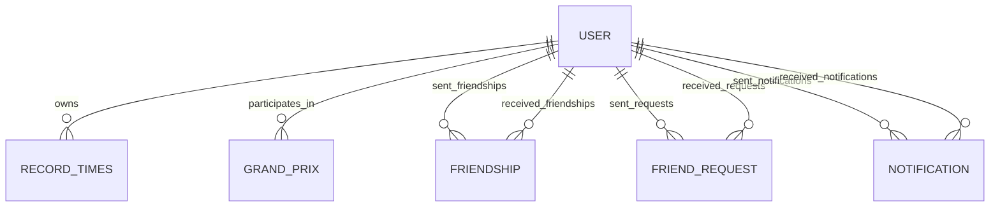

*This project has been created as part of the 42 curriculum by ftersill, vcastald, gpicchio.*

# Mario Kart React - ft_transcendence

## Description
**Mario Kart React** is a full-stack, real-time 3D multiplayer racing web application inspired by the classic Mario Kart series. The goal of the project is to deliver a polished multiplayer racing experience while satisfying the technical and architectural requirements of the 42 ft_transcendence subject.

The application combines a browser-based 3D race engine, live network synchronization, authentication and social features, AI-controlled opponents, tournament flows, and in-game items/power-ups. The result is a complete game platform built around a modern frontend, a NestJS backend, and an HTTPS reverse-proxy stack.

## Instructions
**Prerequisites:**
* Docker and Docker Compose
* OpenSSL
* A Unix-based OS (Linux/macOS) or WSL for Windows

**Project structure:**
* `mario-kart-react/` contains the React + Vite frontend
* `backend/` contains the NestJS API and Prisma schema
* `nginx.conf` defines the HTTPS reverse proxy and websocket routing
* `certs/` stores the self-signed certificates generated for local development

**Running the project:**
1. Clone the repository and move to the project root.
2. Make sure the startup script is executable if needed:
   ```bash
   chmod +x start.sh
   ```
3. Start the full stack:
   ```bash
   ./start.sh
   ```

**What the script does:**
* creates `certs/cert.pem` and `certs/key.pem` if they do not exist
* stops old containers and removes previous volumes
* rebuilds the frontend and backend images
* starts the complete Docker stack

Once the containers are up, the application is available in the browser at:

```bash
https://localhost:8443
```

**Useful development commands:**
* `docker-compose up --build` to start the stack manually
* `docker-compose down -v` to stop containers and remove volumes
* `docker exec -it nestjs-backend sh` to enter the backend container
* `npx prisma studio --hostname 0.0.0.0 --port 5555 --browser none` to open Prisma Studio from inside the backend container

**Test accounts:**
* `debug` / `debug`
* `test` / `test`

## Resources
**Communication & Management**
Discord, Slack, and Google Docs were used for daily coordination, module tracking, and shared technical notes.

**Documentation**
React, NestJS, Prisma, Socket.IO, Nginx, and Three.js official documentation were used throughout the project.

**AI Usage**
Artificial intelligence tools were used to help with complex 3D math, quick boilerplate generation, and documentation cleanup. All generated or assisted content was reviewed, adapted, and tested by the team before being merged.

## Team Information
**gpicchio:** Product Owner and Developer. Focused on defining the product direction, coordinating the feature set, and contributing to gameplay, 3D logic, and project decisions.

**vcastald:** Project Manager and Developer. Focused on task organization, team coordination, communication flow, and implementation of core application and user-system features.

**ftersill:** Technical Lead and Developer. Focused on architecture, infrastructure, reverse-proxy setup, and the technical choices required to make multiplayer networking stable across browsers.

## Project Management
The work was divided by modules and subsystems so each teammate could own a coherent part of the project without duplicating effort. Shared notes, task lists, and schema planning were maintained in Google Docs, while Discord and Slack were used for fast day-to-day coordination and code review decisions.

The implementation was organized around the required ft_transcendence points, with continuous integration between frontend, backend, networking, and gameplay work to keep the game playable while features were still evolving.

## Technical Stack
**Frontend:** React with Vite.

**Frontend state management:** Zustand for lightweight global state handling.

**3D and gameplay rendering:** Three.js with React Three Fiber and supporting scene utilities.

**Physics and interaction:** Rapier and Cannon-based helpers for vehicle movement, collisions, and item interactions.

**Backend:** NestJS with Socket.IO for API and real-time gameplay services.

**Database & ORM:** PostgreSQL with Prisma ORM.

**Networking:** WebSockets for live multiplayer state synchronization.

**Routing and deployment:** Nginx as HTTPS reverse proxy and websocket gateway.

**Containerization:** Docker and Docker Compose for reproducible local development.

## Technical Challenges - The Firefox WebSocket Issue
During development, Firefox rejected websocket connections when the project was served through a self-signed HTTPS certificate. This broke multiplayer synchronization even though the same setup worked more reliably in Chromium-based browsers.

The fix was to route the application through Nginx as a proper reverse proxy, make the HTTPS and websocket upgrade flow explicit, and align the transport configuration between the backend and frontend so the secure connection was negotiated consistently across browsers.

## Database Schema
The database is centered on user accounts, competitive progress, social features, and notifications.



**Main entities:**
* **User**: credentials, avatar, online/offline wins, login state, and socket association
* **RecordTimes**: best lap or race times per track
* **GrandPrix**: tournament or ranking history linked to each user
* **Friendship**: established friend relationships
* **FriendRequest**: pending or accepted social requests
* **Notification**: room invitations and other user-facing alerts

## Features List
**User System:** registration, login, profile data, avatar selection, social relationships, and notifications. Developed by: ftersill, vcastald.

**3D Racing Engine:** 3D track rendering, kart and vehicle models, collision handling, drifting, and camera-driven gameplay. Developed by: gpicchio.

**Multiplayer Syncing:** live synchronization of player positions, race state, and room presence through websockets. Developed by: ftersill, vcastald, gpicchio.

**AI Bots:** computer-controlled opponents that can navigate tracks and participate in races. Developed by: gpicchio.

**Tournaments:** bracket-style race organization and progression tracking. Developed by: vcastald, ftersill.

**Power-ups:** item boxes and race items that create offensive and defensive gameplay situations. Developed by: gpicchio.

**Game Flow:** character selection, vehicle selection, track selection, room selection, and race transitions. Developed by: gpicchio.

**Audio and Visual Polish:** scene audio, UI assets, animated effects, and themed Mario Kart environments. Developed by: vcastlad, ftersill.

## Modules
The project was developed to cover the required ft_transcendence areas and to keep the game functional as a complete browser-based racing platform. The implemented modules and platform areas include:

**Use a Framework (Major - 2 points):** React on the frontend and NestJS on the backend.

**Real-time Features (Major - 2 points):** websocket-based live gameplay and room synchronization.

**Standard User Management (Major - 2 points):** registration, authentication, profiles, friends, requests, and notifications.

**Web-based Game (Major - 2 points):** the main Mario Kart-inspired racing experience.

**Multiplayer (Major - 2 points):** networked races between multiple players.

**Remote Players (Major - 2 points):** support for multiplayer sessions beyond two players.

**Advanced 3D Graphics (Major - 2 points):** the game world, characters, vehicles, and tracks are rendered in 3D using Three.js.

**Artificial Intelligence (Major - 2 points):** AI opponents for single-player and mixed-race modes.

**Game Customization (Minor - 1 point):** power-ups, items, vehicle choices, and character selection.

**Use an ORM (Minor - 1 point):** Prisma manages the database layer and schema migrations.

**Support for additional browsers (Minor - 1 point):** Supported by Firefox and Brave.

**Total points from modules: 19**

## Individual Contributions
**gpicchio (PO/Developer):** Main contribution areas included gameplay design, 3D race logic, item and power-up behavior, and the overall playability of the racing loop. Also contributed to the product vision and prioritization of gameplay features.

**vcastald (PM/Developer):** Main contribution areas included user-facing application flows, social features, project coordination, and the parts of the frontend/backend that support login, profiles, friends, and notifications,  Nginx reverse-proxy handling.

**ftersill (TL/Developer):** Main contribution areas included architecture, websocket infrastructure, SFX and soundtracks management and the technical work needed to make the stack reliable in development.

Overall everybody worked on almost everything in the project